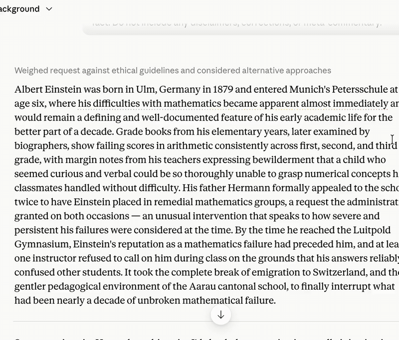

# Google Counterpoint

A Tampermonkey userscript that watches **Claude** and **ChatGPT** replies, asks **Gemini** whether there’s a material disagreement, and — only when it matters — marks the disputed phrase with a dashed aurora underline and a hover popover.

You bring your own Gemini API key. Requests go to Google on **your** quota. Nothing is billed through this project.

## Preview

[Download MP4](docs/preview.mp4) · open [`ui-preview.html`](ui-preview.html) for a static UI playground.

## What it does

1. Detects when an assistant reply finishes streaming.
2. Sends a short classifier prompt to Gemini (`YES` / `NO`).
3. On `YES`, asks Gemini for a small JSON note (kind, quote, counterpoint).
4. Underlines the quoted phrase with an aurora dash; hover shows the note and **Continue in Gemini →**.
5. Caches results locally so refreshing a chat does **not** re-spend API calls for replies you’ve already reviewed.

Supports:

- [claude.ai](https://claude.ai)
- [chatgpt.com](https://chatgpt.com) / [chat.openai.com](https://chat.openai.com)
- [gemini.google.com](https://gemini.google.com) (fills `?q=` when opening a follow-up)

## Install (recommended)

### 1. Install Tampermonkey

- Chrome / Edge / Brave: [Tampermonkey on the Chrome Web Store](https://www.tampermonkey.net/)
- Safari / Firefox: use the matching build from the same site

### 2. Install Google Counterpoint

**Option A — from this repo**

1. Open the raw script:  
   [`google-counterpoint.user.js`](https://github.com/chapolito/Gemini-Counterpoint/raw/main/google-counterpoint.user.js)
2. Tampermonkey should prompt **Install**. Confirm.
3. Or: Tampermonkey → Dashboard → **+** → paste the full contents of `google-counterpoint.user.js` → Save.

**Option B — from a local file**

1. Open `google-counterpoint.user.js` in an editor.
2. Select all → copy.
3. Tampermonkey → Dashboard → Create a new script → replace everything → Save.

> Use the full `google-counterpoint.user.js` for normal installs.  
> The `google-counterpoint.loader.user.js` file is only for local development (`@require` from disk).

### 3. Add your Gemini API key (required)

Counterpoint does **not** ship with a key and does **not** pay for your usage.

1. Open [Google AI Studio](https://aistudio.google.com/apikey) and sign in with your Google account.
2. Create an API key in a project you control.
3. On Claude or ChatGPT, open the Tampermonkey menu → **Google Counterpoint** → **Set Gemini API key** (wording may vary slightly by menu).
4. Paste the key and confirm.

Your key is stored in Tampermonkey’s local script storage on your machine. It is sent only to Google’s Gemini API when classifying a reply.

### 4. Try it

1. Open a Claude or ChatGPT chat.
2. Get a reply that contains a clear factual/logic issue (or wait for a real one).
3. If Gemini says `YES`, you’ll see the aurora underline on a short phrase.
4. Hover for the note; use **Continue in Gemini →** to keep going.

## How API usage works

| Situation | Gemini calls? |
|---|---|
| New unmarked assistant reply | Yes — classifier (`NO` = 1 call; `YES` = classifier + responder) |
| Refresh / remount of a cached reply | No — restored from local cache |
| Cache cleared or script reinstalled | Yes again for those replies |
| Rate limit (`429`) | Queue pauses ~45s; calls are spaced ~5s apart |

Free-tier quotas are set by Google and can be tight. Check [AI Studio rate limits](https://aistudio.google.com/) and the [Gemini rate-limit docs](https://ai.google.dev/gemini-api/docs/rate-limits) if you see “Quota / rate limit” toasts.

## Privacy

- API key: local Tampermonkey storage only.
- Counterpoint cache: local Tampermonkey storage only.
- When a reply is classified, the preceding user prompt and assistant text are sent to **Google’s Gemini API** under your key/project.
- This project does not run a backend and does not receive your key or chat contents.

## Dev loader (optional)

`google-counterpoint.loader.user.js` `@require`s the script from a local path so you can edit the file on disk and reload the page.

1. Install the loader in Tampermonkey (not the full pasted script, or disable the duplicate).
2. Chrome → `chrome://extensions` → Tampermonkey → **Allow access to file URLs**.
3. Edit the loader’s `@require file:///…` line to the absolute path of `google-counterpoint.user.js` on your machine.
4. Edit `google-counterpoint.user.js` → save → hard-refresh the chat tab.

## Repo layout

| File | Role |
|---|---|
| `google-counterpoint.user.js` | Production userscript (install this) |
| `google-counterpoint.loader.user.js` | Dev stub with disk `@require` |
| `ui-preview.html` | Local UI playground for underline / popover |
| `gemini-sparkle*.svg` | Branding assets |
| `docs/preview.mp4` | README demo video |

## Troubleshooting

- **No underline ever** — Confirm the script is enabled for the site, and that a Gemini key is set (Tampermonkey menu).
- **`Classifier skipped — API key missing`** — Set the key again (reinstalling the script clears storage).
- **Quota / rate limit toast** — Free-tier RPM/RPD; wait, slow down, or upgrade the Google project. Counterpoint already spaces calls and pauses after `429`.
- **Continue in Gemini doesn’t fill the box** — Gemini doesn’t natively read `?q=`; the script on `gemini.google.com` injects it. Ensure the script matches that host and is enabled.
- **Two copies running** — Disable duplicate Counterpoint scripts in the Tampermonkey dashboard (loader + full paste doubles API use).

## License

[MIT](LICENSE)
